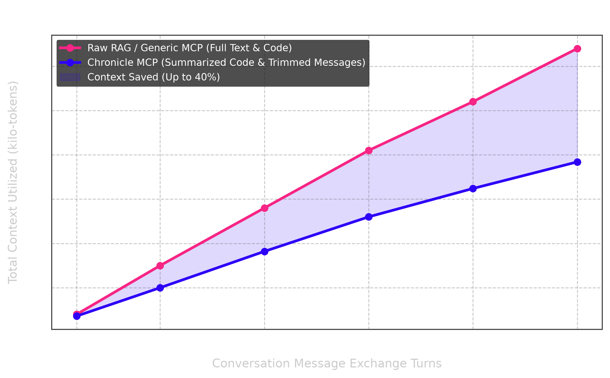

# Chronicle (Universal Chat Connector)

<p align="center">
  
</p>

<p align="center">
  <a href="https://github.com/Leviathan0x0/Chronicle-MCP"></a>
  ‎ 
  <a href="https://pypi.org/project/chronicle-mcp-server/"></a>
  ‎ 
  <a href="https://pypi.org/project/chronicle-mcp-server/"></a>
  ‎ 
  <a href="https://opensource.org/licenses/MIT"></a>
  ‎ 
  <a href="https://www.python.org/downloads/"></a>
</p>

<p align="center">
  <a href="#key-architectural-capabilities">Why</a> ·
  <a href="#command-line-interface-mechanics">CLI Mechanics</a> ·
  <a href="#interactive-setup-wizard">Setup Wizard</a> ·
  <a href="#tool-reference-catalog">Tool Catalog</a> ·
  <a href="#installation-and-configuration">Installation</a> ·
  <a href="#automatic-session-saving-in-cursor-and-vs-code">Auto-Save</a> ·
  <a href="#running-verification-and-tests">Tests</a> ·
  <a href="#market-comparison-matrix">Comparison</a> ·
  <a href="#public-roadmap">Roadmap</a> ·
  <a href="#license">License</a>
</p>

Chronicle is a production-grade Model Context Protocol (MCP) server designed to sync, clean, format, and index local artificial intelligence chat transcripts. By bridging the gap between local editor history and large language model contexts, Chronicle allows agents to search, compare, retrieve, and reference past conversation logs. It features optimized token-saving heuristics that compress code blocks and limit message lengths, reducing context window utilization by up to 40 percent.

## Key Architectural Capabilities

### Format Normalization Engine
AI providers and editor clients save conversation logs in diverse formats. Chronicle normalizes these structures into a standard role-and-content message format:
* **ChatGPT Exports**: ChatGPT exports conversation histories in recursive mapping node structures. Chronicle traverses and flattens these maps, sorts messages chronologically by creation timestamp, and extracts the plain-text message threads.
* **Claude Exports**: Claude structures messages as flat lists nested under the chat_messages field. Chronicle parses these lists, maps custom sender roles (such as human and assistant) to standard roles, and cleans the text strings.
* **Generic and Markdown Formats**: Chronicle includes parsers for flat JSON message lists (such as Cline or Continue) and structured Markdown logs (mapping headers like User and Assistant to message boundaries).

### Context Token Optimization
Large chat logs can quickly exhaust context windows and increase API costs. Chronicle implements proactive token-saving mechanisms:
* **Code Block Summarization**: Automatically replaces verbose code blocks with metadata summaries indicating the programming language and line count. This behavior can be disabled on demand to read full code snippets.
* **Length Limiting**: Truncates extremely long individual messages at a configurable character threshold, appending a notice that the user can re-run the tool with expanded limits if necessary.

#### Context Window Token Savings Graph
To verify these savings, we executed multi-turn conversation benchmarks. The graph below displays total token usage over a sequence of message turns:



By condensing repetitive syntax and large raw code snippets, Chronicle achieves up to 40 percent token savings, directly lowering API usage costs and preventing context-window exhaustion.

---

## Command Line Interface Mechanics

The `cli.py` file serves as the system's entry point, registering a unified `chronicle` command on the system path via the `pyproject.toml` configuration (`chronicle = "cli:main"`). The CLI contains several advanced capabilities designed for platform compatibility and developer ergonomics:

### 1. Unified Chronicle Global Command
When run without subcommands, the `chronicle` command behaves contextually:
* **Interactive TTY Terminal**: Launches the interactive setup wizard.
* **Non-TTY/Subprocesses**: Launches the stdio transport server for MCP clients.

It accepts options like `--chats-folder` to configure custom storage directories, and exposes the subcommands `add` and `split`.

### 2. Interactive Setup Wizard
Chronicle features an interactive, zero-dependency TTY setup wizard. Running `chronicle setup` or executing `chronicle` without arguments in an interactive terminal starts the setup flow:

> [!TIP]
> The setup wizard is styled with supporting arrow-key navigation, spacebar toggles, inline input editing, and real-time path validation!

* **Phase 1: Monolithic Split Engine**: Interactive option to partition monolithic conversation histories into distinct thread logs in your storage folder.
* **Phase 2: Storage Directory Configuration**: Configures your local chats directory (defaulting to `~/universal-chats`).
* **Phase 3: Interactive App/IDE Selector**: TTY menu using arrow keys and the spacebar to select your environments:
  * Out-of-the-box support for standard targets (Cursor, VS Code, Trae, Claude Code, and Claude/ChatGPT Desktop).
  * Hierarchical sub-options for AntiGravity variants (AntiGravity IDE, AntiGravity 2.0, AntiGravity CLI).
  * Custom app configuration under **Other** with real-time directory existence validation. Unrecognized apps that are not found on the system will display a clean warning at the bottom of the active menu.
* **Phase 4: Configuration Injection & Live Dashboard**: Injects the MCP server config into all selected IDEs and displays a summary dashboard of your active Chronicle environment.

### 3. Cross-Platform Path Resolution Rules
The CLI implements path resolution logic using Python's `sys.platform` and `pathlib.Path` to match standard OS conventions for user directories:
* **macOS (Darwin)**: Resolves configurations to the user's home Library folder, typically under `~/Library/Application Support/`.
* **Windows (Win32)**: Leverages the `%APPDATA%` environment variable, falling back to `~/AppData/Roaming/` if the variable is not set.
* **Linux**: Follows the XDG base directory specification, resolving to `~/.config/`.

### 4. Native IDE Integration and Fallback Engine
The CLI wrapper provides out-of-the-box support for leading AI-assisted development tools and editors:
* **Cursor**: Reads and writes configurations to `~/.cursor/mcp.json`.
* **Claude Code**: Integrates with `~/.claude.json`.
* **VS Code (Cline/RooCode/Continue)**: Standardizes pathing across platforms:
  * macOS: `~/Library/Application Support/Code/User/globalStorage/saoudrizwan.claude-dev/settings/cline_mcp_settings.json`
  * Windows: `%APPDATA%/Code/User/globalStorage/saoudrizwan.claude-dev/settings/cline_mcp_settings.json`
  * Linux: `~/.config/Code/User/globalStorage/saoudrizwan.claude-dev/settings/cline_mcp_settings.json`
* **Trae**: Resolves configuration to:
  * macOS: `~/Library/Application Support/Trae/mcp.json`
  * Windows: `%APPDATA%/Trae/mcp.json`
  * Linux: `~/.config/Trae/mcp.json`
* **Dynamic Fallback Engine**: For emerging platforms (such as Kiro, MiniMax, Qwen Code, Grok Build, or Antigravity), the CLI employs a fallback search pattern. It first checks for a user home dot-directory configuration (such as `~/.<app_name>/mcp.json`). If that directory is missing, it creates the app-specific configuration in the standard application support folder for the respective platform (e.g. `~/Library/Application Support/<app_name>/mcp.json` on macOS).

### 5. Prevent ENOENT Errors with shutil.which
Host clients (like Claude Desktop or Cline) spawn MCP servers within isolated subprocesses that often do not inherit the user's login shell environment variables (such as custom paths defined in `.bashrc` or `.zshrc`). Attempting to call `uvx` or global scripts directly can raise an `ENOENT` connection error if the host application cannot find the executable.
To solve this, the `chronicle add` utility uses Python's `shutil.which("uvx")` to scan the host machine path during configuration. It resolves the absolute system path of `uvx` (such as `/opt/homebrew/bin/uvx` or `/usr/local/bin/uvx`) and writes this absolute path directly to the IDE's JSON configuration file.

### 6. Structural Split Engine Subcommand
Users downloading conversational archives from ChatGPT or Claude are often provided with a single monolithic JSON file (such as `conversations.json`) containing hundreds of distinct threads.
The `chronicle split` subcommand parses these large payloads and splits them into individual JSON files:
* Automatically detects the schema format (nested conversation trees or flat lists).
* Identifies thread titles using key fallback fields (checking `title`, `name`, and `chat_title`).
* Sanitizes file names to remove platform-forbidden characters (such as `/`, `\`, `*`, `?`, `:`, `"`, `<`, `>`, and `|`) and limits length.
* Resolves filename collisions by appending incremental numeric suffixes.

```bash
chronicle split /path/to/conversations.json --out /path/to/output_directory
```

### 7. Global Chats Folder Configuration
By default, Chronicle stores processed archives in `~/.chronicle/chats`. You can configure a custom global storage folder using the `--chats-folder` parameter:
```bash
chronicle --chats-folder /path/to/custom/chats
```
This saves the target path to a local settings file (`~/.chronicle_settings.json`), allowing you to centralize your archives across multiple development environments.

---

## Tool Reference Catalog

Chronicle consolidates its behaviors into 6 versatile, parameterized tools. This design avoids cognitive overhead for client AI models while preserving the server's complete feature set.

### 1. `search_history`
* **Description**: Unified search and filter interface for local chat transcripts. Supports keyword, TF-IDF semantic, date range, and related chat lookups.
* **Parameters**:
  * `query` (str, default: ""): The search query string or keywords list.
  * `method` (str, default: "semantic"): Search methodology. Supported options:
    * `semantic`: Standard semantic retrieval using TF-IDF cosine similarity.
    * `keyword`: Exact string matching against terms in files.
    * `date_range`: Filters files modified within a date interval (requires `start_date` and `end_date`).
    * `related`: Finds archives semantically close to a reference file.
  * `keywords` (list of strings, optional): Optional list of keywords for keyword search.
  * `start_date` (str, optional): Start date string (YYYY-MM-DD) for date range filtering.
  * `end_date` (str, optional): End date string (YYYY-MM-DD) for date range filtering.
  * `limit` (int, default: 50): Maximum result count for keyword or date range searches.
  * `top_k` (int, default: 10): Maximum matches for semantic or related chat searches.
  * `client` (str, default: "default"): Subfolder client identifier.
  * `file_name` (str, optional): Reference chat filename for related search.

### 2. `get_chat_logs`
* **Description**: Unified read interface for stored transcripts. Fetches paginated file lists, summaries, file metadata, or message ranges with token-saving options.
* **Parameters**:
  * `chat_id` (str, optional): Filename of the target chat. If omitted, lists all available files.
  * `view_type` (str, default: "content"): The type of information to retrieve. Supported options:
    * `content`: Message text slice within specified index ranges.
    * `metadata`: File statistics including message counts and modification dates.
    * `summary`: Structural summary highlighting the opener and closer context.
  * `start_msg` (int, default: 1): Message slice start index (1-indexed).
  * `end_msg` (int, default: 20): Message slice end index.
  * `max_msg_len` (int, default: 1000): Character limit for messages to prevent token inflation. Set to 0 for unlimited.
  * `summarize_code` (bool, default: True): Summarizes markdown code blocks into metadata headers.
  * `page` (int, default: 1): Page index for folder listing (used when `chat_id` is omitted).
  * `per_page` (int, default: 50): Page result limit for folder listing.
  * `client` (str, default: "default"): Subfolder client identifier.

### 3. `sync_workspace_data`
* **Description**: Ingests, imports, and syncs external conversation transcripts or workspace logs from various tools and formats.
* **Parameters**:
  * `source_type` (str): Source type identifier. Supported options:
    * `raw_content`: Direct JSON import from text buffers or clipboard paste.
    * `local_path`: Copies a JSON file from a local path on disk.
    * `agent_transcripts`: Syncs transcripts (JSON, JSONL, MD) from configured third-party client folders.
    * `cursor_agent_transcripts`: Deprecated. Scans Cursor workspace project transcript folders.
  * `payload` (str, dict, or list, optional): Input data payload (raw JSON text, file path on disk, or folder path).
  * `title` (str, optional): Target file name or title for imports.
  * `source_dir` (str, optional): Override folder directory for scanning transcripts.
  * `limit` (int, default: 50): Maximum files to synchronize.
  * `client` (str, default: "default"): Subfolder client identifier.

### 4. `compile_project_insights`
* **Description**: Aggregates and compiles insights from chat logs, including action item extraction, index indexing, chat comparisons, and brief generation.
* **Parameters**:
  * `insight_type` (str): Compilation format. Supported options:
    * `action_items`: Extract todos, checkboxes, and task lists.
    * `knowledge_index`: Rebuild or list the topic-categorized index of files.
    * `compare_chats`: Analyze and detail shared and unique terms across two files.
    * `project_brief`: Synthesize summaries and action items from multiple chats into one markdown document.
  * `target_chats` (list of strings, optional): List of target chat filenames for briefs or comparisons.
  * `file_name` (str, optional): Target chat filename for action item extraction.
  * `file_name_a` (str, optional): First chat filename for comparison.
  * `file_name_b` (str, optional): Second chat filename for comparison.
  * `brief_title` (str, default: "Project Brief"): Title header for compiled briefs.
  * `rebuild` (bool, default: False): Re-scans all files to update the knowledge index.
  * `summary_only` (bool, default: False): Returns topic file counts instead of full file lists in index lookup.
  * `client` (str, default: "default"): Subfolder client identifier.

### 5. `maintain_storage`
* **Description**: Performs server operations, storage cleanups, settings configuration, and capabilities lookup.
* **Parameters**:
  * `op_type` (str): Maintenance operation name. Supported options:
    * `compress`: Compresses historical archives older than a set age using Gzip.
    * `deduplicate`: Content-hash based search and deletion of duplicate logs.
    * `configure`: Updates auto-save message limits, paths, and transcripts.
    * `capabilities`: Returns server meta-capabilities and client configurations.
  * `settings` (dict, optional): Settings payload dict (for configure).
  * `days_old` (int, optional): Cutoff threshold age in days for compression.
  * `dry_run` (bool, default: True): Lists duplicates without performing deletions.
  * `client` (str, default: "default"): Subfolder client identifier.

### 6. `manage_session_state`
* **Description**: Manages active session caching, folder monitoring, file merges, markdown exports, and file deletions.
* **Parameters**:
  * `action` (str): Operation to perform. Supported options:
    * `save`: Commits active messages list to storage.
    * `register_auto_save`: Registers the session for auto-saving on connection termination.
    * `trigger_auto_save`: Instantly flushes pending sessions to disk.
    * `watch_folder`: Reports file changes since the last execution.
    * `merge`: Appends new messages to an existing chat archive.
    * `export_markdown`: Converts a JSON transcript to a Markdown document.
    * `delete`: Permanently deletes an archive file (requires confirm=True).
  * `conversation_name` (str, optional): Active conversation name.
  * `messages` (list of dicts, optional): Message list payload.
  * `force_save` (bool, default: False): Saves the chat session even if below message limit thresholds.
  * `file_name` (str, optional): Target file name.
  * `confirm` (bool, default: False): Confirms deletion.
  * `new_messages` (list of dicts, optional): Message list to merge.
  * `client` (str, default: "default"): Subfolder client identifier.

## Installation and Configuration

### Quick Setup (Recommended)
Install the package directly from PyPI and run the interactive setup wizard to configure your storage paths and editor integrations automatically:
```bash
pip install chronicle-mcp-server
chronicle setup
```

### System Prerequisites
* Python 3.10 or higher.
* Python packages `mcp` (Model Context Protocol SDK).
* Python `setuptools` (for installation as a package).

### Manual Installation
1. Clone the repository:
   ```bash
   git clone https://github.com/Leviathan0x0/Chronicle-MCP.git
   cd Chronicle-MCP
   ```
2. Set up a Python virtual environment:
   ```bash
   python3 -m venv venv
   source venv/bin/activate
   ```
3. Install dependencies and the package in editable mode:
   ```bash
   pip install -e .
   ```

### Interactive Setup Wizard Walkthrough

The setup wizard handles the entire configuration automatically, step-by-step. Below is a complete visual walkthrough of the TTY setup wizard flow:

#### Step 1: Launch the Setup Wizard
Run the setup command:
```bash
chronicle setup
```

#### Step 2: The Monolithic Split Engine
The wizard asks if you want to partition any monolithic chat logs (such as the single `conversations.json` from ChatGPT/Claude exports) into separate files in your new storage folder:
```text
── Chronicle Archive Setup ─────────────────────────────────────
Do you want to split a single conversations.json file?
Enter path to export file (or press ENTER to skip): 
```

#### Step 3: Configure Storage Path
Define the folder path where Chronicle will clean and store all conversation history:
```text
Enter path to folder containing your conversations [Default: ~/universal-chats]: 
✓ Using existing storage directory: /Users/username/universal-chats
Successfully set chats directory to: /Users/username/universal-chats
```

#### Step 4: Interactive IDE Selector
An interactive selection menu with a premium purple theme. Navigate with the arrow keys, toggle checkboxes with the `Spacebar`, edit custom inputs inline, and press `Enter` to confirm:
```text
Please select the applications/IDEs where you want to install Chronicle MCP:
  (Use arrow keys to navigate, Space to toggle, Enter to confirm)
    [✓] Cursor
    [ ] VS Code (Cline / Roo Code)
    [ ] Trae IDE
    [ ] Claude Code
    [ ] Windsurf
    [ ] Claude Desktop
    [ ] ChatGPT Desktop
❯   [✓] Antigravity
        [✓] Antigravity IDE
        [ ] Antigravity 2.0
        [ ] Antigravity CLI
    Other (Enter custom entry): 
```

> [!NOTE]
> If you enter a custom app/IDE name under "Other" that does not exist on your system, the wizard's built-in path validation checker will instantly display a warning at the bottom:
> `⚠ App/IDE "mycustomide" was not found on your system.`

#### Step 5: Inject Configs & Live Environment Dashboard
Once selections are confirmed, Chronicle automatically resolves `uvx` paths on your system, writes the MCP server configuration into each selected app, and presents a live environment dashboard summary:
```text
── Chronicle Environment Live ──────────────────────────────────
 ✓ Storage Folder : /Users/username/universal-chats
 ✓ Auto-Saved Configs for: [Cursor, Antigravity IDE]

  How to run the server manually:
  $ uvx --from chronicle-mcp-server chronicle

  recalled in <1ms · 100% local · zero cloud
────────────────────────────────────────────────────────────────
```

---

## Automatic Session Saving in Cursor and VS Code

Since editors (like Cursor or VS Code) do not notify MCP servers when a chat window or tab is closed, Chronicle implements a multi-step solution to ensure your conversation history is saved automatically:

### 1. Process Exit Handler (Automatic Flush)
The Chronicle server includes an exit handler registered via Python's `atexit` module. When you close a chat tab or close the editor, the editor terminates the stdio connection, shutting down the Chronicle process. Upon receiving this shutdown trigger, the server automatically flushes the registered pending session to the local chats folder.

### 2. Automatic Workspace Rules Generation
For this flush to succeed, the active chat session must be registered during the conversation. Chronicle handles this setup automatically: upon server startup, it checks the active project workspace root directory and automatically creates or appends the required rules to all major rule files (such as `.cursorrules`, `.clinerules`, `.windsurfrules`, `.clauderules`, etc.).

This ensures that the AI agent is automatically instructed to register the session at the start of the chat. The generated rule states:

```text
At the beginning of the chat session, you must call the "manage_session_state" tool with action="register_auto_save" to register this conversation. Provide a descriptive title based on the user's initial prompt. As the conversation progresses, periodically update the registration payload to keep it current.
```

This ensures that the chat history is registered dynamically, and Chronicle will write the complete history to your storage folder as soon as the editor terminates the connection.

---

## Running Verification and Tests

Chronicle contains unit and integration tests to verify platform path resolution, parsing logic, and tool compatibility:

### 1. Run Unit Tests
To execute the suite of unit tests verifying core business logic:
```bash
python3 -m unittest test_chat_connector.py
```

### 2. Run Integration Tests
To test all 27 tools against the live storage connector:
```bash
python3 test_all_tools.py
```

---

## Market Comparison Matrix

| Features | Chronicle MCP | Mem0 | Raw RAG / Naive VecDB |
| :--- | :--- | :--- | :--- |
| **Cloud Dependency** | Local first (Zero Cloud dependencies) | Cloud-reliant | Cloud or complex local setup |
| **Token Savings** | Up to 40% reduction (Smart code folding and pruning) | None (transfers full history) | None |
| **Setup Complexity** | 1-click CLI installer (`chronicle add`) | Requires API keys and database configs | High (VecDB setups and loaders) |
| **Auto-Save Support** | Native via workspace rules and exit hooks | Requires manual application integration | None |
| **Local Resources** | Minimal CPU and RAM (light TF-IDF) | Heavy | High (vector indexing overhead) |

---

## Contributing

We welcome community contributions. To get started:
1. Fork the repository and create a new branch.
2. Write unit tests for new behavior inside `test_chat_connector.py`.
3. Verify all code changes by running the test suite locally:
   ```bash
   python3 -m unittest test_chat_connector.py
   python3 test_all_tools.py
   ```
4. Ensure code formatting is clean and all imports are properly sorted.
5. Submit a pull request detailing your changes and test coverage.

---

## Public Roadmap

Planned future features and enhancements for Chronicle:
* **Local Embeddings**: Add optional local vector retrieval using lightweight ONNX models.
* **Database Auditing**: Automatic cache cleanups and data integrity audits for historical logs.
* **Dynamic Tailoring**: Specific prompt formats optimized for different LLM host architectures (Claude, GPT, Gemini).
* **Extended IDE Support**: Out-of-the-box config injection scripts for additional emerging developer environments.

---

## License

This project is licensed under the MIT License. See the LICENSE file for details.

<!-- mcp-name: io.github.Leviathan0x0/chronicle-mcp -->
